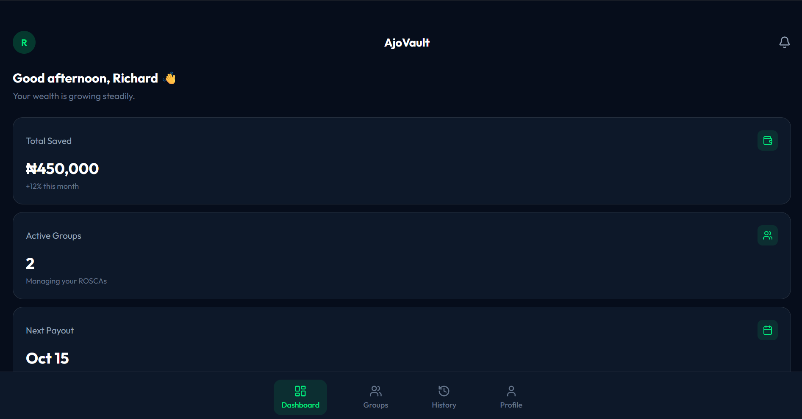
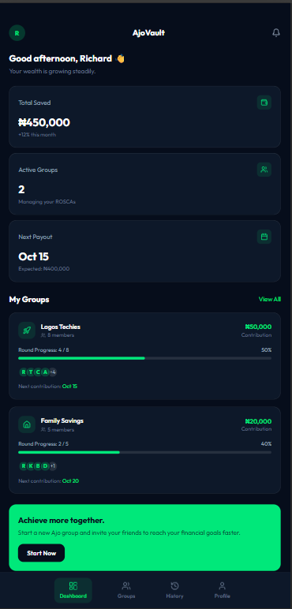

# AjoVault 💰

A digital group savings manager inspired by the Nigerian Ajo/Esusu cooperative savings system. Built to solve a real problem — millions of Nigerians manage their Ajo contributions with paper, WhatsApp, and mental math. AjoVault digitises the entire process.

🔗 **Live site:(https://ajo-vault.vercel.app/)

---

## The Problem

Ajo (also called Esusu or Contribution) is Nigeria's most popular informal savings system. A group of people contribute a fixed amount regularly, and each round one person collects the entire pot. Most groups still track this manually — leading to disputes, missed payments, and zero transparency.

## The Solution

AjoVault gives every Ajo group a digital home — with round tracking, payment status, payout history, and a live group preview before creation.

---

## Features

- 📊 Dashboard with savings overview and active groups
- 👥 Group management with round progress tracking
- ✅ Per-member payment marking (admin only)
- 📋 Payout history with filter tabs
- ➕ Create group with live preview and form validation
- 👤 Profile page with account overview

---
## Screenshot



## Tech Stack

- **React 18** — component-based UI
- **TypeScript** — type-safe JavaScript
- **Tailwind CSS** — utility-first styling
- **Zustand** — global state management
- **React Hook Form** — form handling
- **Zod** — schema validation
- **React Router v6** — client-side routing
- **Vite** — build tool and dev server

---

## Run Locally

```bash
git clone https://github.com/RichieErnie/ajovault.git
cd ajovault
npm install
npm run dev
```

Open [http://localhost:5173](http://localhost:5173)

---

## Project Structure
src/
├── components/    # Reusable UI components
├── pages/         # Full screen views
├── store/         # Zustand state management
├── types/         # TypeScript interfaces
├── data/          # Mock data
└── utils/         # Helper functions

---

## Deployment

Deployed on **Vercel**. Every push to `main` triggers an automatic redeploy.

---

## What's Next

- [ ] Backend integration with real authentication
- [ ] Member invite system via link or code
- [ ] Push notifications for payment reminders
- [ ] Light mode
- [ ] Export payout history as PDF

---

Built with ❤️ in Nigeria by Richard Ogazi · [LinkedIn](https://linkedin.com/in/richardogazi) · [GitHub](https://github.com/RichieErnie)